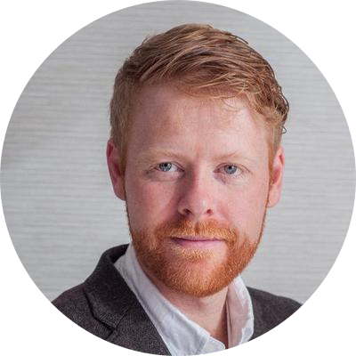

# About Me

I'm Luke Sleeman, a Principal Android Engineer with a passion for building diverse, inclusive, and high-performing teams. I believe great things happen when you empower developers to be their very best.

## Professional Journey

With over 20 years in software development and 11 years specializing in Android, I've had the privilege of working across a diverse range of teams and projects - from small one-person startups to leading teams with over 80 engineers.

Most recently, I helped lead the ANZ Plus Android team, taking on a wide range of responsibilities from guiding tech decisions and building a strong engineering culture, to mentoring engineers and leaders, refining roles, team interactions, and areas of responsibility.

## Personal Side

When I'm not building apps or leading teams, you'll find me:

- **Dragon Boating** - An exciting team sport and fun way to stay fit
- **Hiking** - Exploring the great outdoors with my family
- **Camping** - Getting away from screens and into nature
- **Parenting** - Raising my two awesome kids

I speak a bit of Mandarin, have an inexplicable love for [cakes shaped like animals of the Chinese zodiac](assets/pig-cake.jpg), and am always up for a good cup of tea.

## Community & Leadership Philosophy

I'm passionate about the human side of software development, always seeking ways to empower team members and enhance performance. I believe in creating inclusive environments where everyone can thrive and contribute their best work.  Tech needs to serve humans - not humans serving tech.

From 2016-2021, I was the lead organiser for GDG Melbourne, where I helped grow both the community and our capacity to organise events. During my time there, we ran monthly events, attracted international speakers, and organised several DevFest conferences with hundreds of attendees.

## Speaking & Sharing

I regularly speak on Android and software development topics, both at developer meetups in Australia and internationally, as well as at various conferences. I love sharing knowledge and experiences with the broader developer community.

*"Great things happen when you empower developers to be their very best."*
